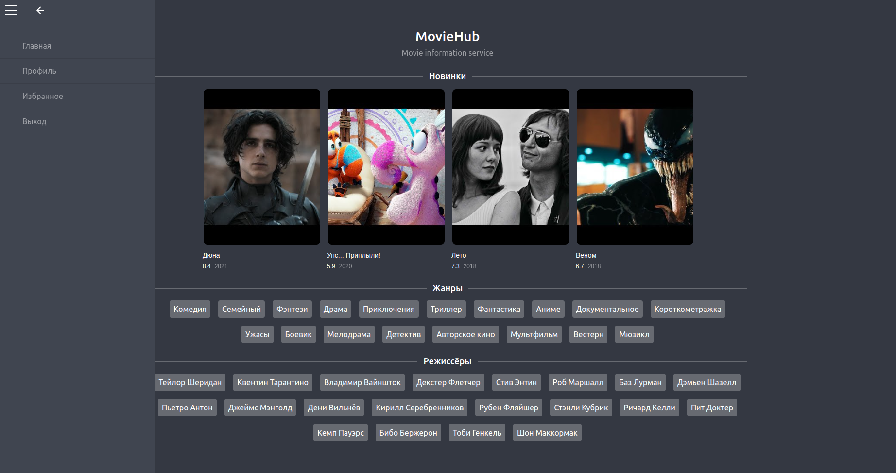

# Movie Hub

On this site you can see information about the films. If you register on the site, the user can add movies to favorites in his personal account



## Requirements

* Python 3.10.6

* Node 19.8.1

## Build

Linux & MacOS

Frontend

1. Go to frontend folder


```bash
cd frontend
```

2. Install node modules

```bash
npm i
```

3. Start frontend server

```bash
npm run start-legacy
```

Backend

1. Go to backend folder


```bash
cd backend
```

2. Create virtual environment

```bash
python3 -m venv venv
```

3. Activate virtual environment

```bash
source venv/bin/activate
```

4. Install requirements

```bash
pip install -r requirements.txt
```

5. Run flask application

```bash
export FLASK_APP=run.py
flask run
```